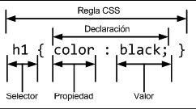

# CSS
CSS es un lenguaje de hojas de estilos para controlar el aspecto de los documentos html.

## Partes de una declaracion css.

Las declaraciones estan formadas por un selector, que es la etiqueta html que refenciamos; la propiedad de css que le queremos aplicar y su valor de la propiedad.

## Maneras de definir valores css.

__Dentro de la etiqueta head__
```
<style>
 /*aca nuestro css*/
</style>
```

__Dentro de la misma etiqueta html__
```
<p style="color:red">texto</p>
```

__En su propio archivo con extencion css__. 
Esta opcion es la mas recomendada para escribir css. Para definir un archivo css, lo unico que tenemos que tener en consideracion es que tenga la extencion .css; y luego referenciamos el archivo desde el head de nuestro html.
```
<head>
    <link rel="stylesheet" href="archivo.css">
</head>
```


## Comentarios
Podemos generar comentarios dentro de nuestro archivo css cubriendo el codigo de la siguiente manera.
```
/*
body {

}
*/
```
Como pueden observar se comenta a travez de back slash y asterisco.


## Como empezar a escribir codigo css.
Cuando empezemos a escribir nuestro codigo css, el mejor enfoque es empezar por los atributos generales de todo nuestro diseño. Empezaremos a escribir los valores globales de estos, como el tipo de fuente, el tamaño de texto, el color mas usado, los tamaños de los titulos, el tamaño de los parrafos, el interlineado de los textos. y siempre agruparemos nuestras declaraciones y nos apoyaremos en los comentarios para poder agrupar estos. Este enfoque sirve para darle un diseño por defecto a cada uno de nuestros elementos con el cual empezar a diseñar. Por ejemplo

```
body {
    font-family: arial;
    font-size: 13px;
    color: black;
}

h1,
h2,
h3 {
    font-family: verdana;
}

h1 {
    font-size: 24px;
}

h2 {
    font-size: 18px;
}

h3 {
    font-size: 16px;
}
```

En el codigo de arriba hemos declarado de manera global estos atributos a nuestra etiqueta contenedora padre que es el __body__. Los hijos que esten dentro del body, osea todas las etiquetas __heredaran__ los valores definidos en su padre. y de esta manera declaramos los valores de manera global para que la __herencia__ haga su trabajo. A los titulos le hemos agregado un tamaño de fuente y una familia distinta, de esta manera ya estamos agregandole su identidad a nuestro diseño; con este enfoque trabajaremos con todas las piezas que se reutilizaran.

